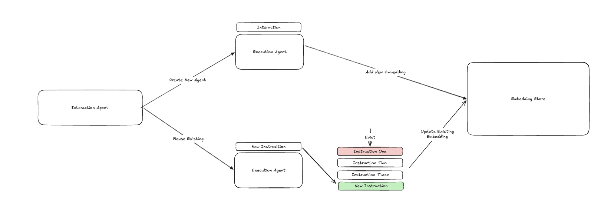
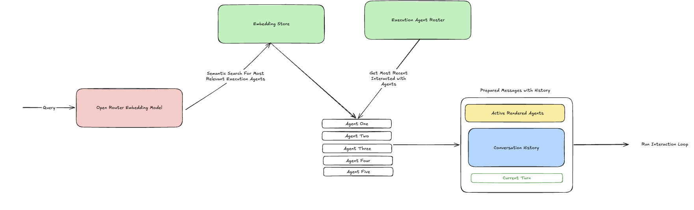

## Fixing Agent Overload Issues

The issue to fix here is as the roster of execution agents grow they begin to overload the context of the interaction agent since every active agent is inserted into the messages of the LLM call at every turn in the ```prepare_message_with_history``` function. Interestingly the blog author's claim that semantic search is a naive solution — this is not necessarily correct. Semantic search (depending on how its implemented of course) is actually a really robust and useful solution to the problem as it is the best way to filter possible agents to a relevant subset and provide only those as agents to be rendered as part of message preparation with history. With this in mind my proposed and implemented solution works as follows:

### Embeddings, Search Space and Roster

A new embedding store (`AgentEmbeddingStore`) is added to the application backed by a JSON file (`embeddings.json`), along with an update to the schema of the roster. The roster was updated from a flat list of agent name strings to a list of dicts containing `name` and `last_interacted` (an ISO timestamp), which gives us the recency data we need for both the fallback strategy and eviction policy.

Both the embedding store and roster use file locking with exponential backoff retries to handle concurrent access safely — important since the embedding updates happen asynchronously and could race with other operations.

#### Execution Agent Creation and Reuse
When an execution agent is created by the interaction agent and added to the roster, a new embedding is added to the embedding store. This entry includes the agent name, the instruction used for the agent, and the embedding vector. The vector is generated using `openai/text-embedding-3-small` via OpenRouter — a small, fast embedding model that keeps latency low while still producing useful semantic representations. The text that gets embedded follows the format ```{agent_name}: {instruction}```.

Whenever an agent is reused (found to already be in the roster), its `last_interacted` timestamp is updated and the agent embeddings are regenerated. For the embedding update, a sliding window of the most recent instructions (configurable via `max_agent_instructions_for_embedding`, defaulting to 3) along with the agent name are used as the embedding text, following the format ```{agent_name}: {instruction_1} | {instruction_2} | {instruction_3}```. This allows the semantic search to bias towards what the agent has most recently done, improving relevancy of results. The older instructions naturally fall off the window as new ones arrive, so the embedding stays current without growing unbounded.

This embedding upsert happens async — fired off as a `loop.create_task` in the `send_message_to_agent` tool handler — to prevent blocking the event loop and adding unneeded latency. This can cause a very narrow edge case whereby a user sends a message that requires an execution agent and the embedding store has not been updated yet, so semantic search may not return that agent as part of the search. To combat this we also pull a set of the top k most recently interacted with agents from the roster and merge them with what semantic search returns when necessary to meet our quota of k results for rendering (this will be explained in the next section where we go through the flow of how the agents are rendered). As updating the embeddings is a very quick operation this edge case is not very likely but is a good thing to cover.




#### Rendering Agents During Conversation

For each user and agent message that gets sent to the LLM, the list of active agents are rendered via the `_render_active_agents` function in `prepare_message_with_history`. The original solution took every agent in the roster, did no processing, and added them all to the set of messages sent to the LLM. The updated solution now does the following:

1. Takes the current message text (user message or agent message)
2. Short-circuits early: if the total number of agents in the roster is already at or below `top_k` (configurable, defaults to 5), all agents are returned directly — no point running semantic search when we'd return everything anyway
3. Embeds that message text using the same open ai embedding model
4. Searches through the embedding store by computing cosine similarity between the embedded message and the stored vector for each execution agent, scoped to only agents currently in the roster
5. Returns the agents with the k highest similarity scores
6. As fallback protection, also retrieves the top k most recently interacted with agents from the roster (sorted by `last_interacted` timestamp). If semantic search fails entirely (exception caught and logged), the recency results are used alone. Otherwise, the two sets are blended: semantic results take priority, then remaining slots are filled with recent agents that weren't already in the semantic results, up to the k quota
7. Renders those filtered agents as part of the chat message with history sent to the LLM



#### Other Notes and Considerations
I had initially had the idea of exposing this agent search as a tool that the interaction agent could call, however quickly dismissed that as it would have introduced more latency, LLM calls and token usage that would not have been of great benefit when we can glean enough useful information from the text of the query and the instructions of the execution agent.

There was still the potential issue of having the number of agents in the roster and the number of embeddings stored grow uncontrollably. This would add potential latency to the semantic search and also expand the search space so much that semantic search would return less relevant execution agent results. To combat this I added a hard cap on the total number of execution agents that can live in the roster and in the embedding store (configurable via `max_execution_agents`, currently defaults to 50). When a new execution agent is spun up, as part of adding it to the roster we check the total count — if it exceeds the hard cap we use an LRU eviction policy based on the `last_interacted` timestamp to remove the least recently used agents from both the roster and the embedding store. The eviction is synchronous with the add operation so the cap is always enforced before the roster is persisted.


