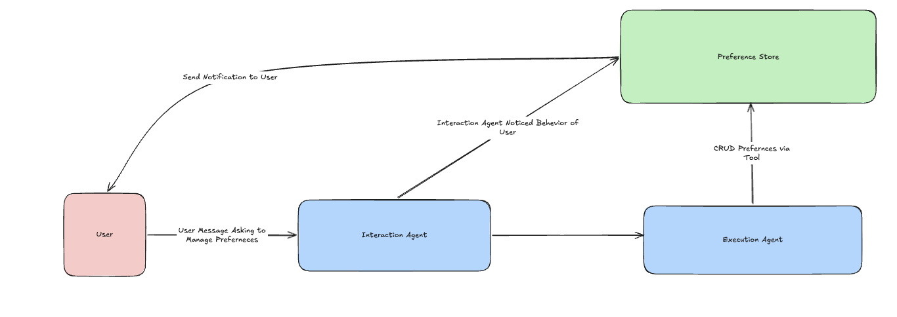
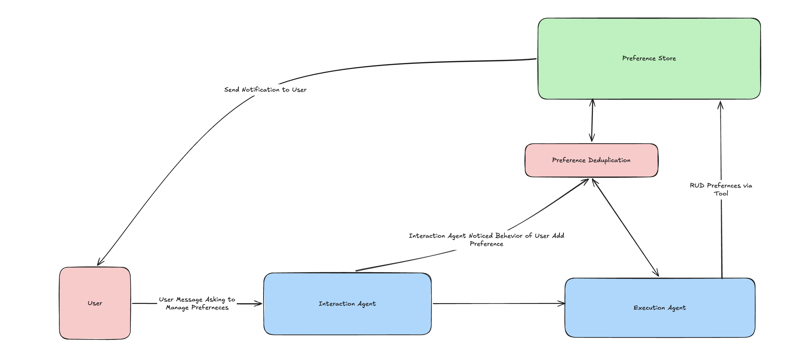
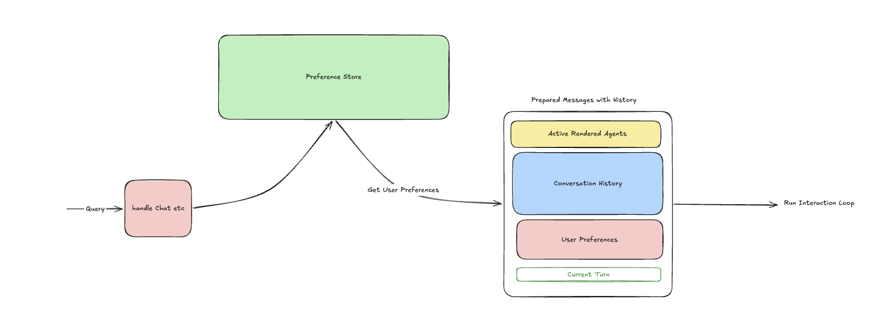

## Added Feature -> Contextual Memory — User Preferences 

### The Idea

The inspiration for this feature comes from two places. The first is concepts like `claude.md` and `agents.md` that we see in modern development tooling — instead of having to constantly remind the AI agents we work with about our quirks, desired behaviours and patterns, it makes much more sense to have a persistent memory that captures these things. OpenPoke is essentially a personal assistant, and a good personal assistant should be tailored to each person and the experience they want to have. Rather than the user having to repeat themselves every session, the system should just know.

The second, and what I think adds an extra bit of brilliance to the idea, is that the interaction agent can also identify and save preferences that it learns from you on its own. This makes OpenPoke feel like an application that is genuinely adapting to you — learning your preferences and tailoring your experience further without you having to do anything. If it notices you always write in lowercase, or that you consistently CC the same person on emails, it picks up on that pattern and saves it as a preference. The user gets a notification when this happens so they're always in the loop, but the fact that it happens proactively makes the experience feel much more alive and personal.

Yes, this does add some extra token cost since the preferences are injected into every turn. But when building products like this there is always a trade-off between added token cost and user experience, and this particular feature and the wow factor of it is well worth the slight increase in tokens used. A personal assistant that remembers how you like things done is fundamentally more useful than one that doesn't.

### How It Works

The preference system is backed by a `PreferenceStore` that persists to a JSON file (`user_preferences.json`), using the same file locking pattern as the roster and embedding store for safe concurrent access. Each preference is stored as an object with an `id`, `content` (the natural language preference text), `source` (either `"user"` for explicitly requested preferences or `"agent"` for ones the interaction agent inferred), and `created_at`/`updated_at` timestamps. There's a hard cap on the total number of preferences (configurable via `max_preferences`, defaults to 20) to prevent unbounded growth.

There are two distinct paths for creating preferences, and this separation is intentional:

**User-explicit preferences** — when the user directly asks OpenPoke to remember something (e.g. "remember that I like formal emails"), the interaction agent delegates this to an execution agent via `send_message_to_agent`. The execution agent has full CRUD tools available: `addPreference`, `updatePreference`, `removePreference`, and `listPreferences`. This means the user can manage their preferences like any other task — add, update, list and delete them through natural conversation.

**Agent-inferred preferences** — the interaction agent has its own `save_preference` tool that it uses when it notices a consistent pattern in the user's behaviour. The key constraint here is that it should only infer from repeated patterns, not a single instance. A user writing in lowercase once doesn't mean they always want lowercase — but if they do it consistently across multiple messages, that's a pattern worth capturing. When the interaction agent saves an inferred preference, it notifies the user with an explanation of what it observed and what it saved, keeping things transparent.

### Preference Deduplication

Without programmatic deduplication, semantically near-duplicate preferences can accumulate over time. A user might say "remember that I like formal emails" in one session and "use a professional tone in emails" in another — both express essentially the same preference, but without enforcement they would occupy two separate slots, wasting capacity and adding noise to the LLM's context window.

To solve this, every new preference is embedded at creation time using `text-embedding-3-small` (the same model used for execution agent embeddings) and the resulting vector is stored inline alongside the preference entry. When a new preference is added — whether user-explicit or agent-inferred — the `PreferenceStore` embeds the incoming text and computes cosine similarity (using numpy for efficient vector operations) against every existing preference's stored embedding. If any existing preference exceeds the configurable similarity threshold (defaults to 0.85, configurable via `OPENPOKE_PREFERENCE_SIMILARITY_THRESHOLD`), the store treats the new preference as a refinement of the existing one: it updates the existing preference's content, regenerates its embedding, and bumps the `updated_at` timestamp. If multiple existing preferences exceed the threshold, the one with the highest similarity score is chosen for the merge.

This is enforced at the store level inside the `add()` method, meaning it applies equally to both creation paths — user-explicit preferences via the execution agent and agent-inferred preferences via the interaction agent's `save_preference` tool. This is a deliberate choice: deduplication is a data integrity concern, not a caller concern, so it belongs in the store rather than being duplicated across tool handlers or relying on LLM prompt instructions (which are inherently unreliable).

The embedding vectors are stripped from preference entries before they are rendered into the LLM context or returned via API responses, so the float arrays never pollute the prompt or inflate token counts.

### Preferences in Context

On every turn, as part of `prepare_message_with_history`, all stored preferences are loaded from the preference store and rendered as XML tags inside a `<user_preferences>` block. Each preference is rendered with its ID and source so the interaction agent knows whether it was user-requested or self-inferred. This block sits at the top of the assembled message — before conversation history, before active agents, before the current turn — giving it high positional weight in the context so the LLM is more likely to attend to these preferences when generating its response.

The interaction agent's system prompt instructs it to let these preferences influence its behaviour and, importantly, to pass relevant preferences along in its instructions to execution agents. So if a user has a preference for formal tone in emails and asks OpenPoke to draft one, the interaction agent should include that tone requirement in the instructions it sends to the execution agent handling the draft.

### Scalabilty Discussion 

There is a question in  this solution as to how you would potentially scale this up to allow for 100s of preferences. The interesting thing about preferences and contextual memory spefically is that they interaction and execution agents need to be aware of preferences at all time, meaning that the best place for them is always being available in conversation context. This fact makes scaling this hard. The most relevant solution to this scaling problem is probably some sort of semantic search solution over preferences based on the user query similar to how we scale the the execution agent issue. Preferences can be flagged with pinned, allowing users to pin prefercnes that will always show up along with results returned from semantic search. This still falls foul of the problem of missing out on preferences potentially but minimises the affect of that. I lean towards more preferences should always be there and the overall benefit of this feature outweighs implementing a solution that may miss preferences. 