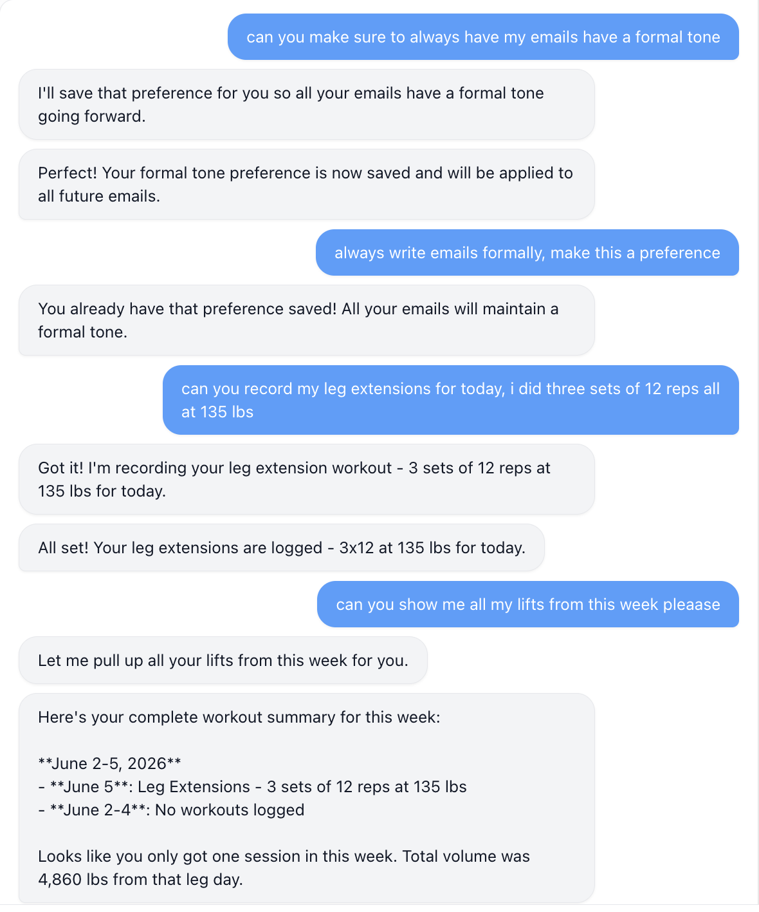

# General Magic Take Home

The aim of this assignment was two fold:

1. Fix the agent overload issue related to the uncontrolled growth of execution agents
2. Add a new AI feature, with a focus on creativity/usefulness

Detailed write-ups for each solution can be found below:

- [Fixing Agent Overload Issues](./AGENT_OVERLOAD.md)
- [Contextual Memory — User Preferences](./CONTEXTUAL_MEMORY.md)

3 relevant PRs 

[Add Extra Layer of Preference Dedup Logic](https://github.com/oladeha2/openpoke/pull/8)

[Update OpenPoke to Contain Preferences and Build Contextual Memory](https://github.com/oladeha2/openpoke/pull/3)

[Improve Agent Overload Solution by Adding Hard Cap and LRU Eviction to Execution Agent Store](https://github.com/oladeha2/openpoke/pull/2)

[Fix Agent Overload Issue using Semantic Search](https://github.com/oladeha2/openpoke/pull/1)

## Added Features (Fun)

After implementing and documenting both main solutions I found myself genuinely enjoying building on top of OpenPoke, so I kept going and added some features I'd actually use if I had this running as a personal assistant on my machine.

### Gym Lift Tracker

I spend a lot of time in the gym and I've never found a tracking app that doesn't feel like a chore to use (or come with a monthly subscription lol). Being able to just tell OpenPoke "I did 3 sets of 10 deadlifts at 30 lbs, leg day" and have it logged would be pretty cool

The toolset covers the full CRUD lifecycle — batch logging with push/pull/legs splits and lbs/kg support, filter-based search (by exercise, split, date range, or any combination) that returns computed stats like total volume and max weight, and filter-based updates and deletes using the same filter semantics. Everything is backed by a `GymLiftStore` following the same JSON persistence patterns as the preference and embedding stores, with four execution agent tools (`logLifts`, `searchLifts`, `updateLifts`, `deleteLifts`) and corresponding system prompt additions.

## Demo Scripts

Two runnable scripts that validate the core mechanisms without needing the full server/Gmail setup. Requires `OPENROUTER_API_KEY` in your `.env`.

### Agent Semantic Search

Demonstrates how the system filters a roster of 10 agents down to the most relevant subset using embedding similarity — the fix for the Execution Agent Overload issue.

```bash
uv run python demo/run_agent_search.py "check my latest emails from Alice" --top-k 3
```

Output ranks all agents by similarity score and highlights which would be rendered in the LLM context.

### Preference Deduplication

Demonstrates how the preference store detects near-duplicate preferences via semantic similarity and merges them instead of creating duplicates.

```bash
uv run python demo/run_preference_dedup.py "I prefer formal, professional tone in my emails"
```

Output shows similarity scores against all existing preferences and clearly indicates when a merge would be triggered (score >= 0.85 threshold).

```bash
# Try with a custom threshold
uv run python demo/run_preference_dedup.py "use kg not lbs for weights" --threshold 0.80
```

### Examples of Features 

The image below shows an example of using the gym tracker and updating prefrences 



[Example of Features](./images/example_two.png)